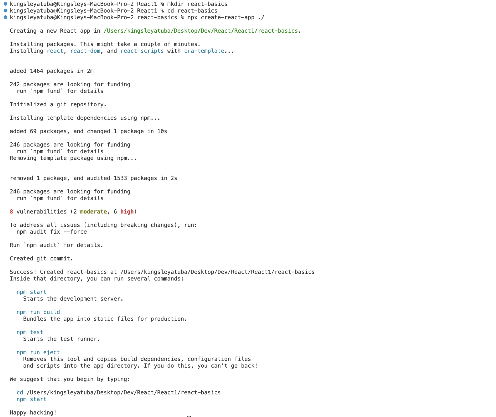
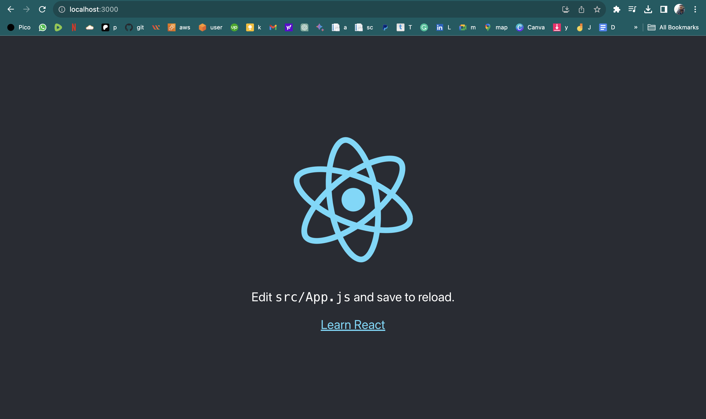
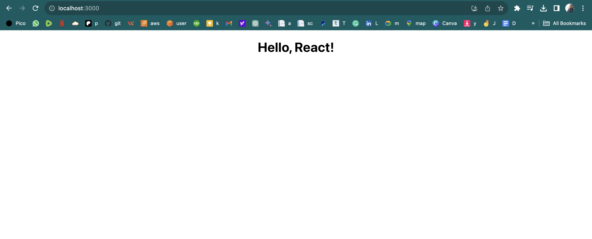

# React Basics


1. Download and install Node.js from official website: 

```
https://nodejs.org/en/download/
```

2. Create a project folder

```
mkdir react-basics
```

2. navigate into it

```
cd react-basics
```

3. Create your react application

```
npx create-react-app ./
```




4. Run npm start

```
npm start
```
you should see the image below when you visit by default or you visit `http://localhost:3000/`



4. Replace App.js with the code below

```
import './App.css';

const App = () => {
  return (
    <div className= "App">
      <h1>Hello, React!</h1>
    </div>
  );
}

export default App;
```

5. Replace index.html with the code below

```
<!DOCTYPE html>
<html lang="en">
  <head>
    <meta charset="utf-8" />
    <link rel="icon" href="%PUBLIC_URL%/favicon.ico" />
    <meta name="viewport" content="width=device-width, initial-scale=1" />
    <meta name="theme-color" content="#000000" />
    <meta
      name="description"
      content="Web site created using create-react-app"
    />
    <link rel="apple-touch-icon" href="%PUBLIC_URL%/logo192.png" />
    <link rel="manifest" href="%PUBLIC_URL%/manifest.json" />
    <title>React App</title>
  </head>
  <body>
    <noscript>You need to enable JavaScript to run this app.</noscript>
    <div id="root"></div>
  </body>
</html>
```

6. you should see the image below in your browser


==

7.